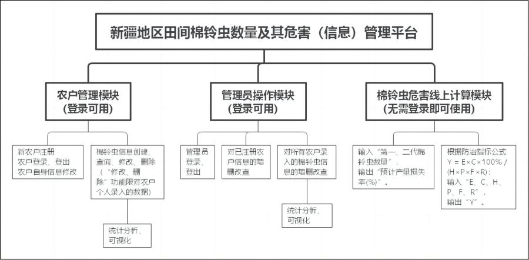
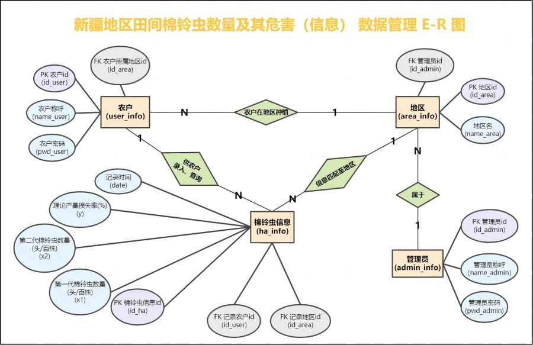
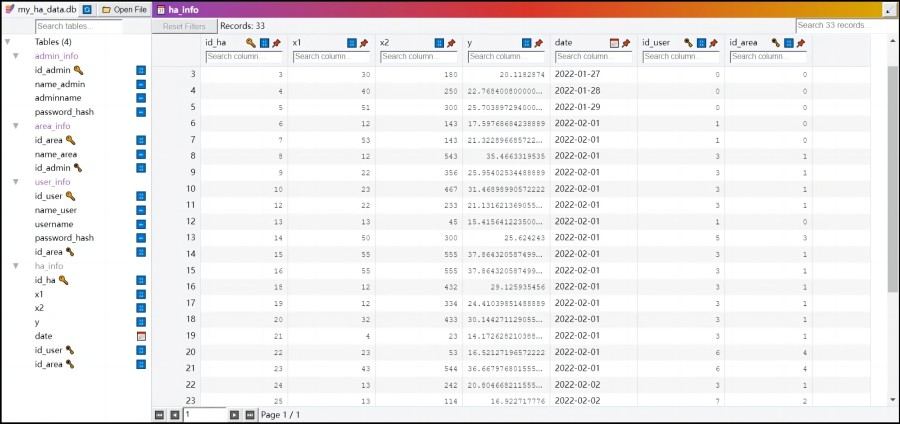
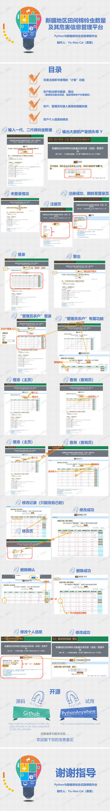

# Python与数据库综合实践课程作业

- 《新疆地区田间棉铃虫数量及其危害（信息）管理平台的设计与实现》

## 1.背景分析

新疆棉区棉铃虫一年可以发生3~4代，对棉花产量可构成严重危害的为第一代和第二代。喀什棉区第二代棉铃虫的危害规律和防治指标有所报道，但新疆第一代棉铃虫对棉花的危害以及第一、二代的复合危害对棉花的影响亦然重要。近几年，喀什地区棉花生产水平提高较快，已制订了多个新的防治指标。当前的棉铃虫害治理存在“农户间联系不够紧密、采样统计数据多、指标多、防治信息传递慢”等问题，认为需要一个信息管理平台对新疆各棉区的棉铃虫虫害情况进行汇总，进一步及时地将预报预测信息传递给农户，并提供更便利的信息服务。

## 2.功能分析、设计模块图

图1 功能分析、设计模块图

图2 实体、属性、联系分析和ER图

图3 ER图转换后的关系模式

---

